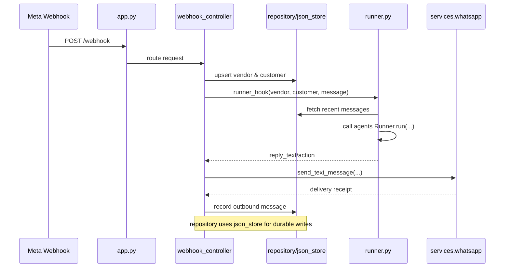

# WhatsApp Orchestration Flow

This document explains how the WhatsApp ingestion and response pipeline works in BazaarFlow. It follows the same style as the integration guide and covers the lifetime of a message across the following modules:

- `backend/app.py`
- `backend/controllers/webhook_controller.py`
- `backend/controllers/vendors_controller.py`
- `backend/lib/json_store.py`
- `backend/lib/repository.py`
- `backend/services/whatsapp.py`
- `backend/runner.py`

## High-Level Sequence

## Component Responsibilities

### `backend/app.py`
- Bootstraps the FastAPI application, configures CORS, and attaches routers.
- Creates a shared `httpx.AsyncClient` via the lifespan hook so downstream controllers reuse one connection pool.
- Registers the webhook, vendor, sales, chat, and inventory routers. Every request begins here before being dispatched to a controller.

### `backend/controllers/webhook_controller.py`
- **GET `/webhook`**: responds to Meta verification handshakes.
- **POST `/webhook`** (`inbound_webhook`): main entry point for WhatsApp callbacks.
  1. Parses payload(s) and extracts individual messages.
  2. Calls `repository.upsert_vendor` and `repository.upsert_customer` to ensure both entities exist in the JSON store.
  3. Records the inbound message via `repository.record_message`.
  4. Invokes `runner.runner_hook` with vendor, customer, message, and metadata.
  5. Sends the AI-generated reply through `services.whatsapp.send_text_message` if the vendor has valid credentials.
  6. Persists the outbound message payload (success or failure) using the repository helpers.
- Provides a `/webhook/test` diagnostic endpoint used by tooling.

### `backend/controllers/vendors_controller.py`
- Exposes REST endpoints that power the dashboard and manual operations.
  - **Vendor lifecycle**: `list_vendors`, `create_vendor`, `get_vendor_settings`, and `update_vendor_settings` manage vendor metadata through the repository.
  - **Customer history**: `list_vendor_customers` and `list_customer_messages` surface JSON-backed chat transcripts.
  - **Manual messaging**: `send_vendor_message` normalizes the phone number, records the attempt, uses `send_text_message`, and persists the result.
  - **Credential validation**: `update_vendor_settings` calls `validate_phone_number` to confirm access tokens before saving them.

### `backend/lib/json_store.py`
- Implements a minimal, file-based datastore with fcntl locking.
- Provides `read`, `write`, and `update` primitives that guarantee atomic writes by using a temporary file and adjacent `.lock` file.
- All higher-level repository mutations rely on this class to avoid race conditions when multiple requests land concurrently.

### `backend/lib/repository.py`
- Wraps the JSON stores (`vendors.json`, `customers.json`, `messages.json`) and offers domain-specific helpers.
- Key functions:
  - `configure_db_root`: allows tests to redirect the database to a temporary folder.
  - `upsert_vendor`, `update_vendor_settings`: create/update vendor profiles and persist the Meta credentials.
  - `upsert_customer`, `list_customers`, `list_messages`, `recent_messages`: manage customer entities and chat history per vendor.
  - `record_message`: appends inbound/outbound events to the messages store with timestamps.
- Acts as the single source of truth for controller and runner modules.

### `backend/services/whatsapp.py`
- Encapsulates calls to the Meta Graph API.
- `send_text_message`: builds the request payload, applies auth headers, performs the HTTP call, and raises `WhatsAppAPIError` with detailed context whenever Meta rejects the request.
- `validate_phone_number`: verifies that the provided `phone_number_id`/`access_token` combination is active before saving credentials.
- Masks tokens in logs to avoid leaking secrets.

### `backend/runner.py`
- Bridges stored state with the OpenAI Agents SDK.
- Maintains per `(vendor, customer)` sessions in memory via `_ensure_session` so the agent has conversation history.
- `_build_prompt`: composes vendor profile, customer details, prior messages, and the current inbound text into a prompt.
- `runner_hook`: orchestrates the agent execution using `Runner.run`, handles JSON/markdown outputs, and guarantees a fallback reply on failure. The controller that called it receives a dict containing `reply_text`, optional `action`, and optional `order_payload`.
- Reads historical messages from the repository to maintain context continuity.

## End-to-End Message Flow

1. **Webhook ingestion**
   - Meta sends a message → FastAPI routes it to `inbound_webhook`.
   - The controller ensures vendor/customer records exist and logs the inbound message via the repository/json_store stack.
2. **Agent reasoning**
   - `runner_hook` builds a prompt with vendor settings, customer profile, and the latest transcript, then calls `Runner.run` with the multi-agent sales assistant.
   - The assistant decides whether to delegate to inventory/finance tools and returns a structured result.
3. **Outbound delivery**
   - When a reply text exists, the webhook controller calls `send_text_message` with the vendor’s access token.
   - Success or failure (including API error payloads) is written back to the messages store for full auditability.
4. **Dashboard/manual APIs**
   - The vendor controller surfaces vendor/customer/message data to the frontend and allows human operators to send manual WhatsApp replies using the same WhatsApp API wrapper.

## Data Persistence

- `json_store.JsonStore` handles file locking and atomic writes.
- `repository` defines the schema (vendors, customers, messages) and provides domain-centric operations.
- Every inbound/outbound message, manual or automated, ultimately passes through `repository.record_message`, ensuring the transcript remains consistent across agents and dashboard views.

## Operational Notes

- `app.py`’s lifespan context creates a shared `httpx.AsyncClient`, preventing socket exhaustion under load.
- Both controllers catch `WhatsAppAPIError` and decorate responses with the raw API payload, which helps diagnose issues such as unapproved contacts or invalid tokens.
- The runner’s session cache is in-memory; restarting the backend clears it, but the persisted transcript in JSON ensures prompts still include prior messages after reload.

This flow provides a clear line of sight from the webhook trigger to the agent decision, outbound delivery, and eventual storage, mirroring the detailed narrative found in the integration guide.
